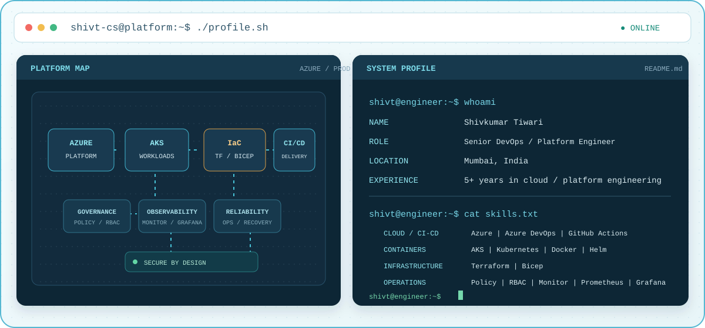

<div align="center">

# Hi, I'm Shivkumar Tiwari



### Cloud Architect | Azure Architecture &amp; Platform Engineering

**Mumbai, India** · I build secure cloud platforms and reliable delivery systems.

<a href="https://shivcshub.com/"></a>
<a href="https://www.linkedin.com/in/shivkumar-tiwari/"></a>
<a href="mailto:Shivkumar.J.Tiwari@gmail.com"></a>

</div>

---

I’m a cloud-focused DevOps and platform engineer with **5+ years of experience** designing secure, scalable Azure environments. My work spans Kubernetes platforms, infrastructure automation, CI/CD, governance, and production operations.

```console
shivt@azure:~$ whoami
Shivkumar Tiwari - Cloud Architect
shivt@azure:~$ stack --core
Azure | AKS | Terraform | Bicep | Helm
shivt@azure:~$ focus --on
Secure platforms | CI/CD | governance | reliability
```

## Areas of Expertise

- **Azure architecture:** landing zones, identity and governance, network design, and resilience patterns
- **DevOps and IaC:** Azure DevOps, GitHub Actions, Terraform/OpenTofu, and release automation
- **Container platforms:** AKS/Kubernetes, Docker, Helm, and platform engineering workflows
- **Security and reliability:** DevSecOps, Azure security baselines, SRE/observability, and compliance-aware delivery
- **Engineering foundations:** Python automation, cloud migration, data platform integration, and AI infrastructure

## Selected Architecture Studies

These are sanitized, illustrative portfolio drafts focused on architecture and implementation patterns, not claims of client deployments.

- [Azure Landing Zone and Terraform/OpenTofu Automation](https://shivcshub.com/projects/azure-landing-zone-iac-modules): reusable subscription onboarding, policy controls, and infrastructure modules.
- [Multi-Environment CI/CD for Angular, .NET, and SQL](https://shivcshub.com/projects/multi-environment-cicd-angular-dotnet-sql): staged releases with quality gates, approvals, and rollback paths.
- [Azure Blob Malware Scanning](https://shivcshub.com/projects/blob-malware-scanning-defender-storage): scan and quarantine uploaded files before downstream processing.
- [AKS Platform Engineering](https://shivcshub.com/projects/aks-platform-engineering): standardized Kubernetes foundations, workload onboarding, and operational guardrails.
- [Azure AI / RAG Infrastructure](https://shivcshub.com/projects/azure-ai-rag-infrastructure): secure, governable foundations for ingestion, indexing, and retrieval.
- [Azure AIOps Incident Intelligence](https://shivcshub.com/projects/azure-aiops-incident-intelligence): telemetry correlation and explainable incident signals with operator oversight.

## Interactive Demos

These demos use deterministic local simulations; they do not connect to live Azure resources.

- [Azure DevOps Release Pipeline Simulator](https://shivcshub.com/demos/azure-devops-pipeline): explore release gates, environment approvals, failure paths, and rollback behavior.
- [AIOps Incident Intelligence Lab](https://shivcshub.com/demos/aiops-incident-lab): inspect synthetic telemetry, probable-cause evidence, and human approval steps.

## How I Approach Platform Work

- **Secure the foundations:** build identity, RBAC, policy, and governance into the platform.
- **Automate repeatable work:** use infrastructure as code and CI/CD to make delivery consistent across environments.
- **Design for operations:** make systems observable, plan for recovery, and keep reliability in view from deployment through production.

## Experience

### Cloud Architect

**May 2026 – Present**

- Azure architecture, solution design, and Azure infrastructure
- Terraform/OpenTofu, Azure DevOps and CI/CD, Kubernetes (AKS), and platform engineering
- DevSecOps, cloud security, SRE, cloud migration and modernization, BCDR, and cost optimization
- TOGAF 10 and system design

### Consultant for Azure (Admin, DevOps and Architect)

**February 2025 – April 2026**

- Aligned cloud architecture, delivery automation, and governance for enterprise workloads.

### Senior Cloud Engineer

**Approx. previous 2.7 years**

- Modernized CI/CD, strengthened platform operations, and scaled container-first delivery practices.

### Azure Cloud Engineer

**Approx. first 1.5 years**

- Supported migration readiness, foundational automation, and secure workload onboarding.

## Technical Toolkit

<p>
	
	
	
	
	
	
	
	
</p>

Also work with Kubernetes, Docker, Azure Policy, RBAC, Azure Monitor, and Grafana.

## Certifications & Credentials

- Microsoft Certified: **Azure Administrator Associate (AZ-104)**
- Microsoft Certified: **Azure DevOps Engineer Expert (AZ-400)**
- Microsoft Certified: **Azure Security Engineer Associate (AZ-500)**
- Microsoft Certified: **Azure Solutions Architect Expert (AZ-305)**
- **TOGAF Practitioner**
- **Microsoft Certified Trainer (MCT)**

## Connect

- Portfolio: [shivcshub.com](https://shivcshub.com/)
- LinkedIn: [linkedin.com/in/shivkumar-tiwari](https://www.linkedin.com/in/shivkumar-tiwari/)
- GitHub: [@ShivT-Cs](https://github.com/ShivT-Cs)
- Email: [Shivkumar.J.Tiwari@gmail.com](mailto:Shivkumar.J.Tiwari@gmail.com)

---

<div align="center">
	<sub>Azure · Platform Engineering · AKS · Infrastructure as Code · Automation</sub>
</div>
